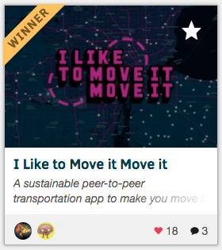

# I Like to Move it Move it!

This project is an web application developed in 36 hours during WinHacks 2020 hackathon! It leverages the use of Google Maps to encourage people to share sustainable transportation like bicycles and scooters around their communities. 

One can simply create an entry to share transportation by clicking the interactive map. After that, the entry will be posted on the map for everyone to see. 

The project is hosted on Google App Engine and it features user authentication through Firebase, data storage through Google Datastore, and a custom map with the Google Maps JavaScript API.

The backend was written in Python with the Flask web framework. The frontend was developed using plain HTML, CSS, and Javascript.

Winner of the **Best Sustainability & Social Impact Hack** 

March 27th-29th, 2020.

For More Information: https://devpost.com/software/move-me-like-you-do

Developed by Nathan Kurelo Wilk & Mauricio Costa
